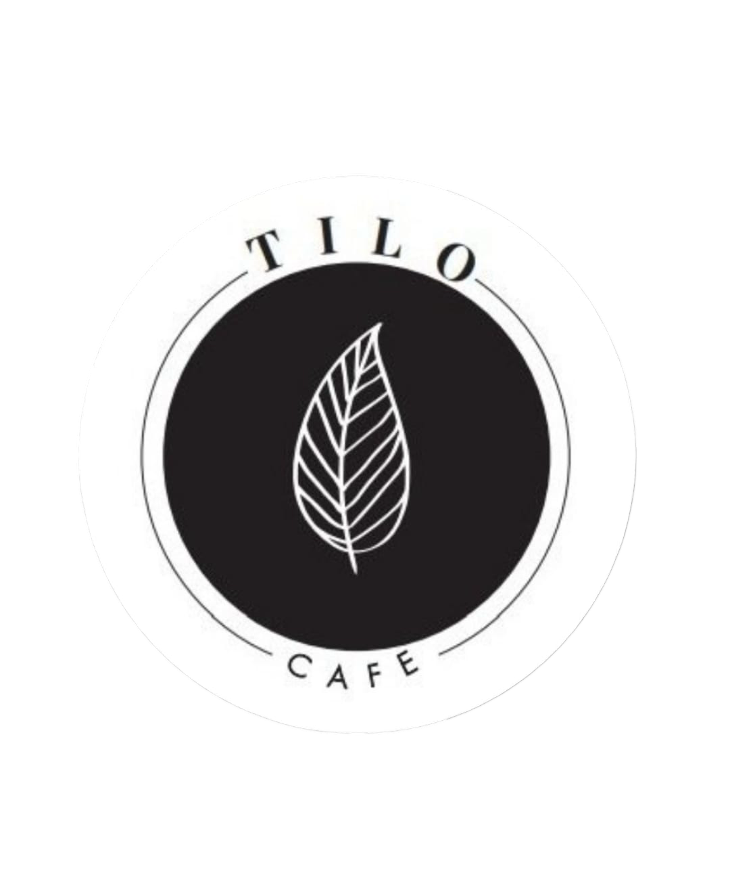
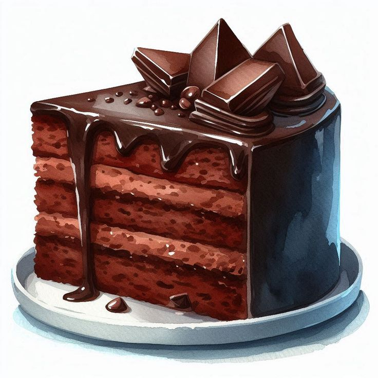

<!DOCTYPE html>
<html lang="es">
<head>
  <meta charset="UTF-8" />
  <meta name="viewport" content="width=device-width, initial-scale=1.0" />
  <title>Tilo Café</title>
  
</head>
<body>
  <header>
  

  </header>
  
¡Bienvenidos a Tilo Café Aguero!

  

    <button onclick="filterCategory('Café')">Café</button>
    <button onclick="filterCategory('Pastelería')">Pastelería</button>
    <button onclick="filterCategory('Promo')">Promoción Café</button>
    <button onclick="filterCategory('Tartas')">Tartas</button>
    <button onclick="filterCategory('Burritos')">Burritos</button>
    <button onclick="filterCategory('Sándwiches')">Sándwiches</button>
    <button onclick="filterCategory('Menú')">Menú del Día</button>
    <button onclick="filterCategory('Sugerencia')">Sugerencia del Día</button>
  

  

    

      
      <h3>Café Espresso</h3>
      
$800

    

    

      
      <h3>Torta de Chocolate</h3>
      
$1200

    

    <!-- Agregar más productos aquí -->
  

  <!-- MODALS -->
  

    <a href="#" class="close">&times;</a>
    
  

  

    <a href="#" class="close">&times;</a>
    
  

  
</body>
</html>
